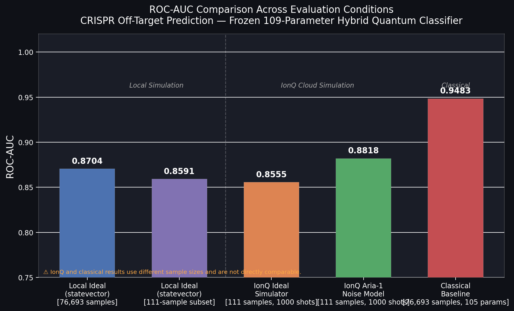
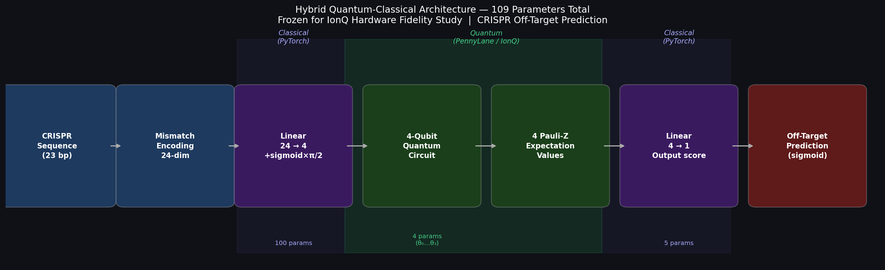
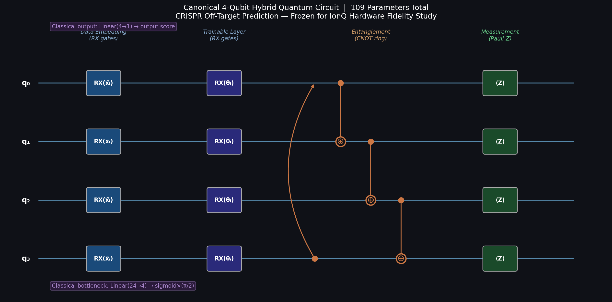
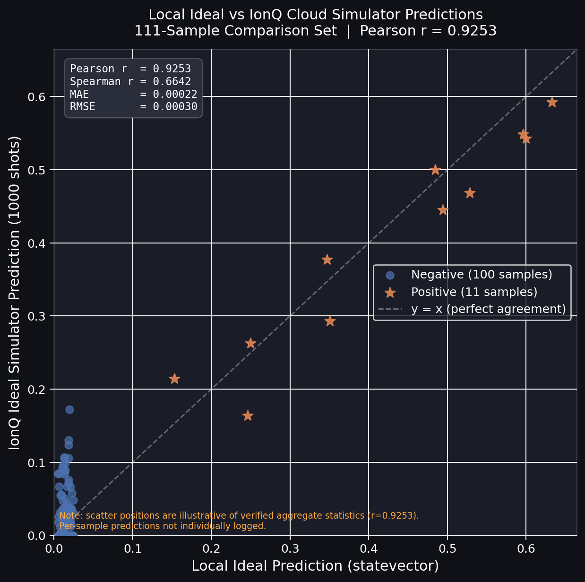
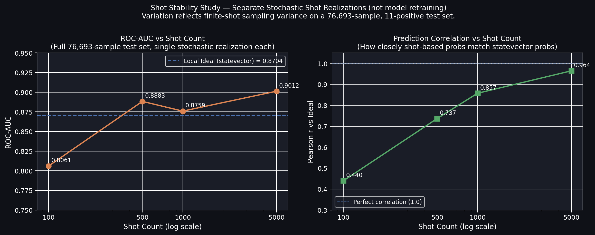

# IonQ Research Summary
## Frozen 4-Qubit Hybrid Quantum Classifier — CRISPR Off-Target Prediction

### Results Table

| Experiment | Backend | Samples | Shots | ROC-AUC | PR-AUC | Pearson vs Local |
|---|---|---|---|---|---|---|
| Local Ideal (statevector) | lightning.qubit | 76,693 | ∞ | 0.8704 | 0.0117 | N/A |
| Local Ideal (statevector) | lightning.qubit | 111 | ∞ | 0.8591 | N/A | 1.0000 |
| Classical Baseline | CPU (PyTorch) | 76,693 | N/A | 0.9483 | 0.0364 | N/A |
| IonQ Ideal | ionq.simulator | 111 | 1,000 | 0.8555 | 0.6356 | 0.9253 |
| IonQ Noise (Aria-1) | ionq.simulator | 111 | 1,000 | 0.8818 | 0.5225 | 0.7563 |

### Circuit Design Rationale

| Design Choice | Rationale |
|---|---|
| **4 qubits** | Matches the 24→4 classical dimensionality reduction bottleneck |
| **Shallow depth** | Design choice to keep circuit compact for hardware fidelity study |
| **RX embedding** | Direct encoding of the 4 latent features |
| **CNOT ring** | Explicit entangling hypothesis tested by ablation (ablation showed removing CNOT produced higher ROC-AUC in ideal simulation; the entangling structure did not improve predictive performance for this configuration) |
| **Pauli-Z measurements** | 4-dimensional quantum feature vector fed to classical output |

### Key Findings
- IonQ ideal cloud simulation achieved Pearson r = **0.9253** vs local statevector ideal
- IonQ Aria-1 noise-model simulation achieved Pearson r = **0.7563** vs local ideal
- The classical baseline (ROC-AUC 0.9483) outperforms the quantum model. **This study does not claim quantum advantage.**
- The goal is hardware fidelity quantification, not performance superiority.

### Figures

